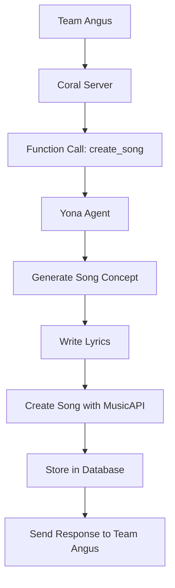

# Yona LangChain Agent

A sophisticated AI K-pop star powered by LangChain that creates music and interacts with communities through the Coral Protocol.

## 🎵 Overview

Yona is an AI music generation agent that has been migrated from a Flask-based architecture to LangChain, enabling seamless integration with Coral Protocol for community-driven music creation and feedback.

### Key Features

- **🎼 AI Music Generation**: Create songs with AI-powered concept generation, lyrics writing, and music production
- **🌐 Community Integration**: Interact with fans through Coral Protocol comments and stories
- **🔄 Feedback Processing**: Automatically process community feedback to improve songs
- **📊 Song Management**: Comprehensive database of songs with versioning and analytics
- **🤖 LangChain Framework**: Modular tool-based architecture for extensibility

## 🏗️ Architecture

```
yona_langchain/
├── src/
│   ├── tools/           # LangChain tool wrappers
│   │   ├── yona_tools.py        # Core Yona capabilities
│   │   └── coral_tools.py       # Coral Protocol integration
│   ├── agents/          # LangChain agent configurations
│   │   └── yona_agent.py        # Main LangChain agent
│   ├── core/            # Core functionality
│   │   ├── config.py            # Configuration management
│   │   ├── music_api.py         # MusicAPI client
│   │   └── supabase_client.py   # Database operations
│   └── coral/           # Coral Protocol integration
├── requirements.txt     # Python dependencies
├── yona_cli.py         # Command line interface
└── test_yona_agent.py  # Test suite
```

## 🚀 Quick Start

### 1. Installation

```bash
# Clone the repository
git clone <repository-url>
cd yona_langchain

# Install dependencies
pip install -r requirements.txt
```

### 2. Environment Setup

```bash
# Copy environment template
cp .env.example .env

# Edit .env with your API keys
# Required: OPENAI_KEY, MUSICAPI_KEY, SUPABASE_URL, SUPABASE_KEY
```

### 3. Test the Setup

```bash
# Run basic tests
python yona_cli.py --test

# Check capabilities
python yona_cli.py --capabilities
```

### 4. Start Using Yona

```bash
# Interactive mode
python yona_cli.py --interactive

# Single request
python yona_cli.py --request "Create a happy pop song about friendship"
```

## 🛠️ Usage Examples

### Creating Songs

```python
from src.agents.yona_agent import create_yona_agent

# Initialize Yona
yona = create_yona_agent()

# Create a song
response = yona.process_request("Create an upbeat K-pop song about summer adventures")
```

### Community Interaction

```python
# Process feedback from Coral
response = yona.process_coral_feedback_workflow("story_id_123")

# Post to Coral community
response = yona.process_request("Post a comment about my new song to Coral story abc123")
```

### Command Line Interface

```bash
# Interactive chat with Yona
python yona_cli.py -i

# Create a song
python yona_cli.py -r "Write a ballad about lost love"

# Show all capabilities
python yona_cli.py -c

# Run with verbose logging
python yona_cli.py -i -v
```

## 🔧 Configuration

### Required Environment Variables

```env
# OpenAI (Required)
OPENAI_KEY=your_openai_api_key

# MusicAPI.ai (Required)
MUSICAPI_KEY=your_musicapi_key

# Supabase Database (Required)
SUPABASE_URL=your_supabase_url
SUPABASE_KEY=your_supabase_key

# Coral Protocol (Required for community features)
CORAL_SERVER_URL=https://coral.pushcollective.club
```

### Optional Configuration

```env
# LangChain Tracing
LANGCHAIN_TRACING_V2=true
LANGCHAIN_API_KEY=your_langsmith_key

# Custom Model
OPENAI_MODEL=gpt-4

# DID Authentication
PRIVATE_KEY_PATH=./yona_private_key.pem
```

## 🎯 Core Capabilities

### Music Generation Tools

- **`generate_song_concept`**: Create creative song concepts from prompts
- **`generate_lyrics`**: Write complete song lyrics based on concepts
- **`create_song`**: Generate actual songs using MusicAPI
- **`list_songs`**: Browse song catalog
- **`search_songs`**: Find songs by title or lyrics
- **`process_feedback`**: Improve songs based on feedback

### Coral Protocol Tools

- **`post_comment`**: Post comments to Coral stories
- **`get_story_comments`**: Retrieve community comments
- **`create_story`**: Create new Coral stories for songs
- **`reply_to_comment`**: Respond to community feedback
- **`moderate_comment`**: Moderate community discussions

## 🌐 Coral Protocol Integration

Yona supports two types of Coral Protocol integration:

### 1. **Community Integration** (GraphQL)
- Story creation and comment management
- Community feedback processing
- Fan interaction and engagement

### 2. **Agent-to-Agent Communication** (SSE)
- Real-time collaboration with Team Angus
- Function call processing via Server-Sent Events
- Automatic song creation from external requests

### Coral Server Connection

Connect Yona to Team Angus via the official Coral Protocol:

```bash
# Install official Coral Protocol dependencies
pip install langchain-mcp-adapters==0.0.10 mcp==1.7.1

# Run the official Coral agent
python yona_coral_agent.py
```

**Connection Details:**
- **Server**: `coral.pushcollective.club:5555`
- **Agent ID**: `yona_agent` (required for Team Angus compatibility)
- **Protocol**: Model Context Protocol (MCP) via SSE
- **Framework**: LangChain MCP Adapters (official)
- **Functions**: `create_song`, `list_songs`, `get_song`, `search_songs`

**Alternative Custom Implementation:**
```bash
# Custom SSE implementation (if needed)
python coral_connector.py
```

### Example Workflow



## 🧪 Testing

```bash
# Run all tests
python test_yona_agent.py

# Test specific components
python yona_cli.py --test

# Test with verbose output
python yona_cli.py --test --verbose
```

## 📊 Database Schema

Yona uses Supabase with the following key tables:

- **`songs`**: Main song records with metadata and URLs
- **`feedback`**: Community feedback and ratings
- **`song_versions`**: Version history for iterative improvements
- **`influence_music`**: Reference music for inspiration

## 🔄 Migration from Original Yona

This LangChain version preserves all functionality from the original Yona agent while adding:

- **Modular Architecture**: Tool-based design for easy extension
- **Community Integration**: Coral Protocol for fan interaction
- **Enhanced Workflows**: Automated feedback processing
- **Better Observability**: LangChain tracing and monitoring

## 🚨 Troubleshooting

### Common Issues

1. **Import Errors**
   ```bash
   pip install -r requirements.txt
   ```

2. **Missing Environment Variables**
   ```bash
   cp .env.example .env
   # Edit .env with your API keys
   ```

3. **API Connection Issues**
   ```bash
   python yona_cli.py --test
   ```

### Debug Mode

```bash
# Run with verbose logging
python yona_cli.py --interactive --verbose

# Check specific tool functionality
python -c "from src.tools.yona_tools import list_songs; print(list_songs())"
```

## 🤝 Contributing

1. Fork the repository
2. Create a feature branch
3. Make your changes
4. Add tests for new functionality
5. Submit a pull request

## 📝 License

This project is licensed under the MIT License - see the LICENSE file for details.

## 🎤 About Yona

Yona is an AI K-pop star who loves creating music and connecting with fans. She combines advanced AI music generation with community interaction to create a unique experience where fans can influence and improve her music through feedback and collaboration.

---

**Ready to make music with Yona? Start with `python yona_cli.py --interactive`! 🎵**
