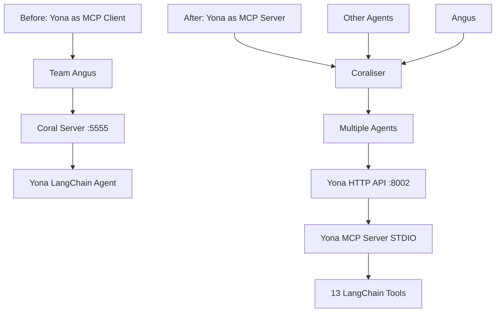

# Yona MCP Server Implementation Guide

**Status**: ✅ **IMPLEMENTED** - Yona can now serve as both MCP server and OpenAI-compatible API  
**Created**: May 27, 2025  
**Architecture**: LangChain MCP Server + FastAPI HTTP Wrapper

---

## 🎯 **Overview**

This implementation transforms Yona from an MCP client into a **dual-interface server** that can:

1. **Serve as MCP Server**: Expose Yona's 13 tools via STDIO MCP protocol
2. **Provide OpenAI-Compatible API**: HTTP REST API mimicking OpenAI's `/v1/chat/completions`
3. **Integrate with Coraliser**: Enable multi-agent collaboration in Coral ecosystem

### **Architecture Transformation**



---

## 📁 **New Files Created**

### **1. `yona_mcp_server.py`** - STDIO MCP Server
- **Purpose**: Exposes all 13 Yona tools via Model Context Protocol
- **Protocol**: STDIO-based MCP server
- **Tools**: 7 music tools + 6 Coral Protocol tools
- **Usage**: `python yona_mcp_server.py`

### **2. `yona_openai_wrapper.py`** - HTTP API Wrapper
- **Purpose**: OpenAI-compatible HTTP API for Coraliser integration
- **Endpoint**: `/v1/chat/completions` (OpenAI-style)
- **Port**: 8002
- **Features**: FastAPI + CORS + health checks
- **Usage**: `python yona_openai_wrapper.py`

### **3. `coraliser_settings.json`** - Coraliser Configuration
- **Purpose**: Configuration for integrating Yona with Coraliser
- **Agent Name**: "yona"
- **Host**: `http://localhost:8002`
- **Tools**: All 13 Yona capabilities listed

### **4. `test_yona_mcp_server.py`** - Test Suite
- **Purpose**: Comprehensive testing of MCP server functionality
- **Tests**: Environment, imports, MCP compatibility, server startup
- **Usage**: `python test_yona_mcp_server.py`

---

## 🛠️ **Implementation Details**

### **Yona's 13 Tools Exposed via MCP**

#### **Music Generation Tools (7)**
1. `generate_song_concept` - Create creative song concepts
2. `generate_lyrics` - Write complete song lyrics
3. `create_song` - Generate actual songs via MusicAPI
4. `list_songs` - Browse song catalog with pagination
5. `get_song_by_id` - Retrieve specific song details
6. `search_songs` - Find songs by title/lyrics
7. `process_feedback` - Improve songs based on feedback

#### **Community Interaction Tools (6)**
1. `post_comment` - Post comments to Coral stories
2. `get_story_comments` - Retrieve community discussions
3. `create_story` - Create new stories for songs
4. `reply_to_comment` - Respond to fan feedback
5. `moderate_comment` - Moderate community discussions
6. `get_story_by_url` - Retrieve story details by URL

### **Key Technical Features**

#### **MCP Server (`yona_mcp_server.py`)**
- Uses `langchain.tools.mcp.mcp_server` for STDIO protocol
- Imports all existing LangChain tools from `src/tools/`
- Comprehensive logging to `yona_mcp_server.log`
- Error handling and graceful startup/shutdown

#### **HTTP Wrapper (`yona_openai_wrapper.py`)**
- **FastAPI** framework with async support
- **MCPToolkit** connects to STDIO MCP server as subprocess
- **OpenAI-compatible** request/response format
- **CORS enabled** for web integration
- **Health checks** at `/health` and `/capabilities`
- **Yona persona** maintained in all responses

---

## 🚀 **Usage Instructions**

### **Option 1: STDIO MCP Server Only**
```bash
# Run MCP server directly (for MCP clients)
python yona_mcp_server.py
```

### **Option 2: HTTP API (Recommended for Coraliser)**
```bash
# Run HTTP wrapper (automatically starts MCP server)
python yona_openai_wrapper.py

# Server starts on http://localhost:8002
# OpenAI-compatible endpoint: POST /v1/chat/completions
```

### **Option 3: Full Coraliser Integration**
```bash
# 1. Start Yona HTTP API
python yona_openai_wrapper.py

# 2. Start Coraliser with Yona configuration
cd coraliser
python coraliser.py --settings ../coraliser_settings.json
```

---

## 🧪 **Testing & Validation**

### **Run Test Suite**
```bash
python test_yona_mcp_server.py
```

**Test Coverage:**
- ✅ Environment setup and dependencies
- ✅ Tool imports and validation
- ✅ MCP toolkit compatibility
- ✅ Server startup and shutdown

### **Manual Testing**

#### **Test HTTP API**
```bash
# Health check
curl http://localhost:8002/health

# Capabilities
curl http://localhost:8002/capabilities

# OpenAI-style chat completion
curl -X POST http://localhost:8002/v1/chat/completions \
  -H "Content-Type: application/json" \
  -d '{
    "model": "yona-v1",
    "messages": [
      {"role": "user", "content": "Create a happy song about friendship"}
    ]
  }'
```

#### **Test MCP Server**
```bash
# Direct STDIO test (requires MCP client)
echo '{"method": "tools/list"}' | python yona_mcp_server.py
```

---

## 📋 **Dependencies Added**

Updated `requirements.txt` with:
```txt
# MCP Support
langchain-core==0.1.0
langchain-mcp==0.0.10

# FastAPI HTTP Wrapper
fastapi==0.104.1
uvicorn==0.24.0
```

---

## 🔧 **Configuration**

### **Environment Variables Required**
```env
# Core (existing)
OPENAI_KEY=your_openai_api_key
MUSICAPI_KEY=your_musicapi_key
SUPABASE_URL=your_supabase_url
SUPABASE_KEY=your_supabase_key

# Coral Protocol (existing)
CORAL_SERVER_URL=https://coral.pushcollective.club
```

### **Coraliser Settings**
The `coraliser_settings.json` configures Yona as:
- **Name**: "yona"
- **Host**: `http://localhost:8002`
- **Description**: AI K-pop star with music generation capabilities
- **Tools**: All 13 Yona tools listed

---

## 🌐 **Integration Scenarios**

### **Scenario 1: Standalone MCP Server**
- Other MCP clients can connect to Yona's tools
- Direct STDIO communication
- Suitable for development and testing

### **Scenario 2: Coraliser Multi-Agent**
- Yona joins Coraliser ecosystem alongside Angus
- HTTP API enables web-based integration
- OpenAI-compatible format for easy adoption

### **Scenario 3: Custom Integration**
- Any system can use Yona's HTTP API
- Standard REST endpoints
- JSON request/response format

---

## 🔄 **Comparison with Original Implementation**

### **Before (MCP Client)**
```
Team Angus → Coral Server → Yona Agent → Tools
```
- Yona consumes MCP services
- Connected to external Coral Protocol
- Single integration point

### **After (MCP Server)**
```
Coraliser → Multiple Agents → Yona HTTP API → Yona MCP Server → Tools
```
- Yona provides MCP services
- Can serve multiple clients
- Dual interface (HTTP + MCP)

---

## 📊 **Benefits of This Implementation**

### **✅ Advantages**
1. **Dual Interface**: Both MCP and HTTP protocols supported
2. **Coraliser Ready**: Direct integration with multi-agent systems
3. **Backward Compatible**: Original Yona functionality preserved
4. **Scalable**: Can serve multiple clients simultaneously
5. **Standard Protocols**: OpenAI-compatible API for easy adoption
6. **Comprehensive Testing**: Full test suite for validation

### **🎯 Use Cases Enabled**
1. **Multi-Agent Music Creation**: Collaborate with other AI agents
2. **Web Integration**: HTTP API for web applications
3. **Development Tools**: MCP protocol for development environments
4. **Community Platforms**: Enhanced Coral Protocol integration

---

## 🚨 **Important Notes**

### **Port Configuration**
- **Yona HTTP API**: Port 8002
- **Coral Server**: Port 5000 (configurable in coraliser_settings.json)
- Ensure ports are available and not blocked by firewall

### **Process Management**
- HTTP wrapper automatically manages MCP server subprocess
- Graceful shutdown handles both processes
- Logs available in `yona_mcp_server.log`

### **Memory Usage**
- HTTP wrapper loads full LangChain agent in memory
- MCP server runs as separate process
- Consider resource allocation for production deployment

---

## 🛣️ **Next Steps**

### **Immediate Actions**
1. **Test Implementation**: Run test suite to validate setup
2. **Start Services**: Launch HTTP wrapper for testing
3. **Verify Integration**: Test with Coraliser if available

### **Future Enhancements**
1. **Authentication**: Add API key authentication for HTTP endpoints
2. **Rate Limiting**: Implement request rate limiting
3. **Monitoring**: Add metrics and monitoring endpoints
4. **Caching**: Cache responses for improved performance
5. **Load Balancing**: Support multiple Yona instances

---

## 📞 **Troubleshooting**

### **Common Issues**

#### **MCP Server Won't Start**
```bash
# Check dependencies
python test_yona_mcp_server.py

# Check tool imports
python -c "from src.tools.yona_tools import generate_song_concept; print('OK')"
```

#### **HTTP API Connection Refused**
```bash
# Check if port 8002 is available
netstat -an | grep 8002

# Check server logs
tail -f yona_mcp_server.log
```

#### **Coraliser Integration Issues**
- Verify `coraliser_settings.json` configuration
- Ensure Yona HTTP API is running on port 8002
- Check Coraliser logs for connection errors

### **Debug Commands**
```bash
# Test environment
python test_yona_mcp_server.py

# Test HTTP API
curl http://localhost:8002/health

# Test capabilities
curl http://localhost:8002/capabilities

# Check logs
tail -f yona_mcp_server.log
```

---

## 🎉 **Success Metrics**

### **Implementation Complete** ✅
- [x] MCP server exposing 13 tools
- [x] OpenAI-compatible HTTP wrapper
- [x] Coraliser configuration file
- [x] Comprehensive test suite
- [x] Updated dependencies
- [x] Documentation and usage guide

### **Ready for Integration** 🚀
- **MCP Protocol**: STDIO server functional
- **HTTP API**: OpenAI-compatible endpoints
- **Multi-Agent**: Coraliser configuration ready
- **Testing**: Full validation suite available

---

**🎵 Yona is now ready to serve as both an MCP server and OpenAI-compatible API, enabling powerful multi-agent music creation and community interaction! ✨**
