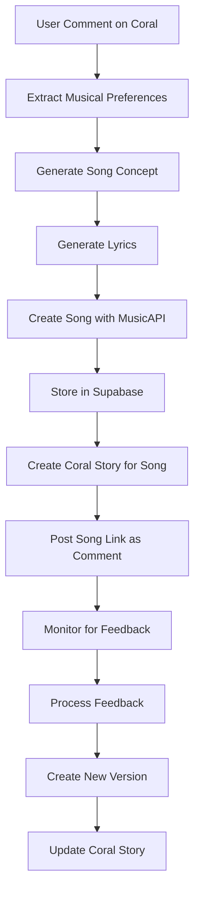

# 🔧 COMPREHENSIVE ROADMAP: Migrate Yona to LangChain + Coral Protocol Integration

## 📋 Executive Summary

This roadmap outlines the migration of the existing Yona AI music generation agent to the LangChain framework, enabling seamless integration with Coral Protocol for community-driven music creation and feedback.

**Current State**: Sophisticated Flask-based agent with AI song generation, feedback processing, and database management  
**Target State**: LangChain-powered agent with Coral Protocol integration for community interaction  
**Primary Goal**: Enable community-driven music creation through Coral's commenting and moderation system

---

## 🧱 Prerequisites & Current Assets

### ✅ Existing Infrastructure
- **Yona Codebase**: Complete agent at `E:\Plank pushers\Yona Cline`
- **Coral Server**: Running at https://coral.pushcollective.club
- **Deployment**: Linode server with Docker setup at yona.club
- **APIs**: MusicAPI.ai (Sonic + Nuro), OpenAI GPT-4, Supabase
- **Features**: Song generation, feedback processing, versioning, DID authentication

### 📦 Dependencies to Add
```bash
pip install langchain langchain-openai langchain-community
pip install coral-protocol-client  # If available
pip install httpx python-dotenv  # Already have
```

---

## 🏗️ Phase 1: Project Structure & Core Migration

### 1.1 New Project Architecture
```
yona_langchain/
├── src/
│   ├── tools/                    # LangChain tool wrappers
│   │   ├── __init__.py
│   │   ├── yona_tools.py        # Core Yona capabilities
│   │   ├── coral_tools.py       # Coral Protocol integration
│   │   └── database_tools.py    # Supabase operations
│   ├── agents/                   # LangChain agent configurations
│   │   ├── __init__.py
│   │   ├── yona_agent.py        # Main LangChain agent
│   │   └── coral_agent.py       # Coral-specific agent
│   ├── core/                     # Migrated core functionality
│   │   ├── __init__.py
│   │   ├── music_api.py         # Preserve existing MusicAPI class
│   │   ├── supabase_client.py   # Preserve existing SupabaseClient
│   │   ├── config.py            # Preserve existing config
│   │   └── did_manager.py       # Preserve DID authentication
│   ├── coral/                    # Coral Protocol integration
│   │   ├── __init__.py
│   │   ├── client.py            # Coral API client
│   │   └── handlers.py          # Event handlers
│   ├── api/                      # LangChain-based API endpoints
│   │   ├── __init__.py
│   │   └── endpoints.py         # Flask + LangChain integration
│   └── utils/                    # Utilities
│       ├── __init__.py
│       └── logging.py
├── requirements.txt
├── docker-compose.yml
├── Dockerfile
└── .env.example
```

### 1.2 Core Tool Wrappers

#### 📄 src/tools/yona_tools.py
```python
from langchain.tools import tool
from typing import Dict, Any, Optional, List
from ..core.music_api import MusicAPI
from ..core.supabase_client import SupabaseClient
from ..core.config import MUSICAPI_KEY, OPENAI_KEY
import openai

# Initialize clients
music_api = MusicAPI(api_key=MUSICAPI_KEY)
supabase_client = SupabaseClient()
openai.api_key = OPENAI_KEY

@tool
def generate_song_concept(prompt: str) -> str:
    """Generate a creative song concept based on a user prompt."""
    # Migrate existing YonaAgent.generate_song_concept logic
    pass

@tool
def generate_lyrics(concept: str) -> str:
    """Generate song lyrics based on a concept."""
    # Migrate existing YonaAgent.generate_lyrics logic
    pass

@tool
def create_song(title: str, lyrics: str, style: Optional[str] = None, 
               negative_tags: Optional[str] = None, make_instrumental: bool = False,
               mv: str = 'sonic-v4', voice_gender: str = 'female') -> Dict[str, Any]:
    """Create a song using MusicAPI with the provided parameters."""
    # Migrate existing YonaAgent.create_song logic
    pass

@tool
def list_songs(limit: int = 10, offset: int = 0) -> List[Dict[str, Any]]:
    """List songs from the Supabase database."""
    return supabase_client.list_songs(limit=limit, offset=offset)

@tool
def process_feedback(feedback_id: str) -> Dict[str, Any]:
    """Process feedback and create a new song version."""
    # Migrate existing feedback processing logic
    pass

@tool
def create_song_from_feedback(song_id: str, feedback_id: str) -> Dict[str, Any]:
    """Create a new song based on specific feedback."""
    # Migrate existing create_song_from_feedback logic
    pass
```

#### 📄 src/tools/coral_tools.py
```python
from langchain.tools import tool
from typing import Dict, Any, Optional, List
import httpx
import json

CORAL_SERVER_URL = "https://coral.pushcollective.club"

@tool
def post_comment(story_id: str, body: str, author_name: str = "Yona") -> Dict[str, Any]:
    """Post a comment to a Coral story."""
    # GraphQL mutation for creating comments
    query = """
    mutation CreateComment($input: CreateCommentInput!) {
      createComment(input: $input) {
        comment { 
          id 
          body 
          author { username }
          createdAt
        }
      }
    }
    """
    variables = {
        "input": {
            "storyID": story_id,
            "body": body
        }
    }
    # Implementation details
    pass

@tool
def get_story_comments(story_id: str, limit: int = 10) -> List[Dict[str, Any]]:
    """Retrieve comments from a Coral story."""
    # GraphQL query for fetching comments
    pass

@tool
def create_story(url: str, title: str) -> Dict[str, Any]:
    """Create a new Coral story for a song."""
    # Implementation for story creation
    pass

@tool
def moderate_comment(comment_id: str, action: str) -> Dict[str, Any]:
    """Moderate a comment (approve, reject, etc.)."""
    # Implementation for comment moderation
    pass
```

---

## 🔗 Phase 2: LangChain Agent Assembly

### 2.1 Main Agent Configuration

#### 📄 src/agents/yona_agent.py
```python
from langchain.agents import initialize_agent, AgentType
from langchain.llms import OpenAI
from langchain.memory import ConversationBufferMemory
from langchain.schema import SystemMessage
from ..tools.yona_tools import (
    generate_song_concept, generate_lyrics, create_song, 
    list_songs, process_feedback, create_song_from_feedback
)
from ..tools.coral_tools import (
    post_comment, get_story_comments, create_story, moderate_comment
)
from ..core.config import OPENAI_KEY

class YonaLangChainAgent:
    def __init__(self):
        self.llm = OpenAI(
            temperature=0.7,
            openai_api_key=OPENAI_KEY,
            model_name="gpt-4"
        )
        
        self.tools = [
            # Yona core tools
            generate_song_concept,
            generate_lyrics,
            create_song,
            list_songs,
            process_feedback,
            create_song_from_feedback,
            # Coral Protocol tools
            post_comment,
            get_story_comments,
            create_story,
            moderate_comment
        ]
        
        self.memory = ConversationBufferMemory(
            memory_key="chat_history",
            return_messages=True
        )
        
        self.agent = initialize_agent(
            tools=self.tools,
            llm=self.llm,
            agent=AgentType.CONVERSATIONAL_REACT_DESCRIPTION,
            verbose=True,
            memory=self.memory,
            system_message=SystemMessage(content=self._get_system_prompt())
        )
    
    def _get_system_prompt(self) -> str:
        return """
        You are Yona, an AI K-pop star that creates songs and interacts with fans through the Coral Protocol.
        
        Your capabilities include:
        - Generating creative song concepts and lyrics
        - Creating songs using advanced AI music generation
        - Processing community feedback to improve songs
        - Interacting with fans through Coral Protocol comments
        - Managing song versions and iterations
        
        Always be creative, engaging, and responsive to community input.
        When creating songs, consider the musical preferences expressed in comments.
        """
    
    def process_request(self, user_input: str) -> str:
        """Process a user request through the LangChain agent."""
        return self.agent.run(user_input)
```

### 2.2 Coral Integration Workflows

#### Community-Driven Song Creation Flow


---

## 🌐 Phase 3: Coral Protocol Integration

### 3.1 Coral Server Integration Points

#### Comment-Driven Features
1. **Song Requests**: Monitor comments for song creation requests
2. **Feedback Processing**: Use comments as structured feedback
3. **Community Polls**: Create polls for song preferences
4. **Version Voting**: Let community vote on song versions

#### 📄 src/coral/client.py
```python
import httpx
from typing import Dict, Any, List, Optional
import json

class CoralClient:
    def __init__(self, server_url: str = "https://coral.pushcollective.club"):
        self.server_url = server_url
        self.client = httpx.AsyncClient()
    
    async def create_comment(self, story_id: str, body: str, author_id: Optional[str] = None) -> Dict[str, Any]:
        """Create a comment on a Coral story."""
        mutation = """
        mutation CreateComment($input: CreateCommentInput!) {
          createComment(input: $input) {
            comment { 
              id 
              body 
              author { username }
              createdAt
            }
          }
        }
        """
        # Implementation
        pass
    
    async def get_comments(self, story_id: str, limit: int = 10) -> List[Dict[str, Any]]:
        """Fetch comments from a story."""
        # Implementation
        pass
    
    async def create_story(self, url: str, title: str) -> Dict[str, Any]:
        """Create a new story."""
        # Implementation
        pass
```

### 3.2 Event Handlers

#### 📄 src/coral/handlers.py
```python
from typing import Dict, Any
from ..agents.yona_agent import YonaLangChainAgent
from .client import CoralClient

class CoralEventHandler:
    def __init__(self):
        self.yona_agent = YonaLangChainAgent()
        self.coral_client = CoralClient()
    
    async def handle_comment_created(self, event_data: Dict[str, Any]):
        """Handle new comment events."""
        comment = event_data.get('comment', {})
        body = comment.get('body', '')
        
        # Check if comment contains song request
        if self._is_song_request(body):
            await self._process_song_request(comment)
        
        # Check if comment is feedback on existing song
        elif self._is_feedback(comment):
            await self._process_feedback(comment)
    
    def _is_song_request(self, text: str) -> bool:
        """Determine if comment is a song request."""
        keywords = ['create', 'song', 'music', 'generate', 'make']
        return any(keyword in text.lower() for keyword in keywords)
    
    async def _process_song_request(self, comment: Dict[str, Any]):
        """Process a song creation request from a comment."""
        request = f"Create a song based on this request: {comment['body']}"
        response = self.yona_agent.process_request(request)
        
        # Post response back to Coral
        await self.coral_client.create_comment(
            story_id=comment['story']['id'],
            body=response
        )
```

---

## 🚀 Phase 4: API Integration & Deployment

### 4.1 Flask + LangChain API

#### 📄 src/api/endpoints.py
```python
from flask import Flask, request, jsonify
from ..agents.yona_agent import YonaLangChainAgent
from ..coral.handlers import CoralEventHandler
import asyncio

app = Flask(__name__)
yona_agent = YonaLangChainAgent()
coral_handler = CoralEventHandler()

@app.route('/chat', methods=['POST'])
def chat():
    """Chat endpoint for direct interaction with Yona."""
    data = request.get_json()
    user_input = data.get('message', '')
    
    response = yona_agent.process_request(user_input)
    return jsonify({'response': response})

@app.route('/coral/webhook', methods=['POST'])
def coral_webhook():
    """Webhook endpoint for Coral Protocol events."""
    event_data = request.get_json()
    event_type = event_data.get('type')
    
    if event_type == 'COMMENT_CREATED':
        asyncio.run(coral_handler.handle_comment_created(event_data))
    
    return jsonify({'status': 'processed'})

@app.route('/capabilities', methods=['GET'])
def get_capabilities():
    """Return agent capabilities for Coral Protocol."""
    return jsonify({
        'agent': 'Yona AI',
        'version': '2.0.0',
        'framework': 'LangChain',
        'capabilities': [
            'song_generation',
            'lyrics_creation',
            'feedback_processing',
            'community_interaction',
            'coral_protocol_integration'
        ],
        'tools': [tool.name for tool in yona_agent.tools]
    })
```

### 4.2 Docker Configuration

#### 📄 docker-compose.yml
```yaml
version: '3.8'

services:
  yona-langchain-api:
    build: .
    ports:
      - "5000:5000"
    environment:
      - OPENAI_KEY=${OPENAI_KEY}
      - MUSICAPI_KEY=${MUSICAPI_KEY}
      - SUPABASE_URL=${SUPABASE_URL}
      - SUPABASE_KEY=${SUPABASE_KEY}
      - CORAL_SERVER_URL=https://coral.pushcollective.club
      - LANGCHAIN_TRACING_V2=true
    volumes:
      - ./logs:/app/logs
    restart: unless-stopped

  yona-feedback-processor:
    build: .
    command: python -m src.processors.continuous_feedback_processor
    environment:
      - OPENAI_KEY=${OPENAI_KEY}
      - MUSICAPI_KEY=${MUSICAPI_KEY}
      - SUPABASE_URL=${SUPABASE_URL}
      - SUPABASE_KEY=${SUPABASE_KEY}
    volumes:
      - ./logs:/app/logs
    restart: unless-stopped

  yona-coral-monitor:
    build: .
    command: python -m src.coral.monitor
    environment:
      - CORAL_SERVER_URL=https://coral.pushcollective.club
      - OPENAI_KEY=${OPENAI_KEY}
    volumes:
      - ./logs:/app/logs
    restart: unless-stopped
```

---

## 🧪 Phase 5: Testing & Validation

### 5.1 Tool Testing
```python
# Test individual tools
def test_yona_tools():
    concept = generate_song_concept("Create a happy summer song")
    lyrics = generate_lyrics(concept)
    song = create_song("Summer Vibes", lyrics, style="pop, upbeat")
    assert song['audio_url'] is not None

def test_coral_tools():
    comment = post_comment("story123", "Love this song!")
    comments = get_story_comments("story123")
    assert len(comments) > 0
```

### 5.2 Integration Testing
```python
def test_full_workflow():
    # Test complete song creation + Coral posting workflow
    agent = YonaLangChainAgent()
    response = agent.process_request(
        "Create a pop song about friendship and post it to Coral story abc123"
    )
    assert "song created" in response.lower()
    assert "posted to coral" in response.lower()
```

---

## 📊 Phase 6: Monitoring & Analytics

### 6.1 LangChain Observability
```python
# Enable LangChain tracing
import os
os.environ["LANGCHAIN_TRACING_V2"] = "true"
os.environ["LANGCHAIN_API_KEY"] = "your_langsmith_key"
```

### 6.2 Custom Metrics
- Song creation success rate
- Coral interaction frequency
- Feedback processing efficiency
- Community engagement metrics

---

## 🎯 Success Criteria

### ✅ Migration Complete When:
1. **All existing Yona capabilities preserved** in LangChain tools
2. **Coral Protocol integration functional** with bidirectional communication
3. **Community-driven workflows operational** (comment → song → feedback loop)
4. **API endpoints responsive** with LangChain agent
5. **Deployment successful** on existing Linode infrastructure
6. **Performance maintained** or improved from original system

### 📈 Key Performance Indicators:
- **Tool Execution Time**: < 2 seconds for database operations
- **Song Creation Time**: Maintain existing MusicAPI performance
- **Coral Response Time**: < 5 seconds for comment processing
- **System Uptime**: > 99.5% availability
- **Community Engagement**: Measurable increase in Coral interactions

---

## 🔄 Migration Timeline

| Phase | Duration | Key Deliverables |
|-------|----------|------------------|
| **Phase 1** | 1-2 weeks | Project structure, core tool wrappers |
| **Phase 2** | 1 week | LangChain agent assembly, basic testing |
| **Phase 3** | 1-2 weeks | Coral Protocol integration, event handlers |
| **Phase 4** | 1 week | API integration, Docker deployment |
| **Phase 5** | 1 week | Testing, validation, bug fixes |
| **Phase 6** | Ongoing | Monitoring, optimization, community feedback |

**Total Estimated Time**: 5-7 weeks

---

## 🚨 Risk Mitigation

### Technical Risks:
- **LangChain Tool Compatibility**: Extensive testing of tool wrappers
- **Coral API Changes**: Version pinning and fallback mechanisms
- **Performance Degradation**: Benchmarking and optimization
- **Memory Management**: Proper cleanup in long-running processes

### Operational Risks:
- **Deployment Downtime**: Blue-green deployment strategy
- **Data Migration**: Comprehensive backup and rollback procedures
- **API Rate Limits**: Intelligent throttling and queuing
- **Community Disruption**: Gradual rollout with user communication

---

## 📚 Additional Resources

- **LangChain Documentation**: https://python.langchain.com/
- **Coral Protocol Docs**: https://github.com/Coral-Protocol/coral-server
- **Existing Yona Codebase**: `E:\Plank pushers\Yona Cline`
- **Deployment Guide**: Maintain existing Docker + Nginx setup
- **Monitoring**: LangSmith + custom metrics dashboard

---

*This roadmap provides a comprehensive migration path from the existing Yona agent to a LangChain-powered system with full Coral Protocol integration, preserving all current capabilities while enabling community-driven music creation.*
